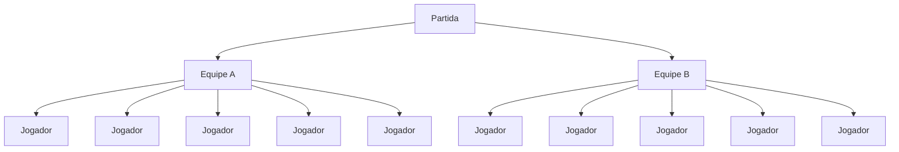
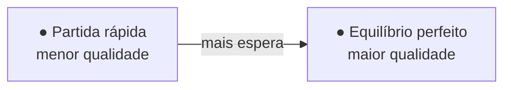
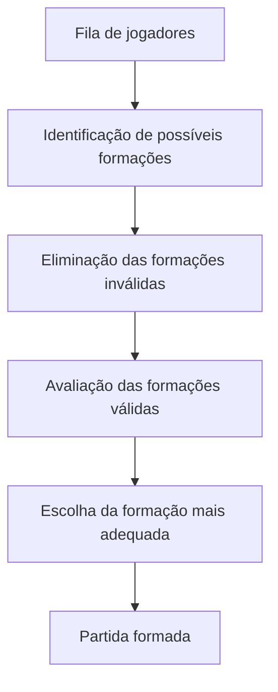

# Problema - Matchmaking competitivo

## 1. Contexto

Jogos competitivos baseados em equipes precisam formar partidas a partir de jogadores que estão esperando em uma fila.

O objetivo de um sistema de matchmaking é encontrar jogadores que possam participar da mesma partida de maneira adequada. Porém, "adequada" não significa apenas colocar jogadores com habilidades semelhantes.

Existem vários fatores que precisam ser considerados simultaneamente:

- habilidade dos jogadores;
- posições que cada jogador aceita desempenhar;
- tempo que cada jogador está esperando;
- latência de conexão;
- existência de grupos ou duplas;
- composição das equipes;
- equilíbrio entre as duas equipes.

Esses fatores podem entrar em conflito.

Por exemplo, pode existir uma formação quase perfeita em termos de habilidade, mas que exigiria que um jogador esperasse vários minutos. Também pode existir uma formação que começa imediatamente, mas possui uma diferença de habilidade maior ou coloca vários jogadores fora de sua posição preferida.

O projeto trata esse cenário como um problema de decisão: **dada uma fila de jogadores, qual formação de partida representa o melhor compromisso entre os critérios de qualidade definidos?**

## 2. Inspiração no League of Legends

O problema é inspirado nos desafios conhecidos de sistemas de matchmaking de jogos competitivos, especialmente *League of Legends*.

Entretanto, o projeto não pretende reproduzir o sistema real da Riot Games. O algoritmo utilizado em um jogo comercial pode possuir informações, métricas e mecanismos internos que não estão disponíveis publicamente.

Portanto, o projeto abstrai o problema e cria um modelo próprio. O jogo serve como contexto para explicar por que os critérios são relevantes, mas a especificação deverá ser independente de uma implementação ou sistema comercial específico.

## 3. O que significa uma boa partida?

Uma boa partida deverá apresentar, idealmente:

1. equipes com níveis de habilidade semelhantes;
2. posições adequadamente distribuídas;
3. poucos jogadores fora de suas posições preferidas;
4. baixa diferença de latência entre os jogadores, quando possível;
5. grupos respeitados;
6. tempo de espera aceitável.

Nenhum desses critérios deverá ser tratado isoladamente.

O problema central é justamente encontrar uma forma de equilibrá-los.

### Exemplo

Considere duas possíveis formações:

**Formação A**

- diferença de habilidade: muito baixa;
- todos estão em posições preferidas;
- tempo de espera: 5 minutos.

**Formação B**

- diferença de habilidade: baixa;
- um jogador está em posição alternativa;
- tempo de espera: 40 segundos.

O sistema precisa possuir critérios que permitam decidir qual formação é preferível.

Essa decisão é parte importante do problema que será estudado ao longo do projeto.

## 4. Modelo dos jogadores

Cada jogador será descrito por um conjunto de informações:

### Identificação

Um identificador único para distinguir o jogador dos demais.

### Habilidade

Um valor numérico que representa a habilidade estimada do jogador.

Esse valor é uma abstração. O projeto não precisa reproduzir o cálculo real de MMR de nenhum jogo.

### Posições

Cada jogador possui uma posição preferida e pode possuir posições alternativas.

Exemplo:

```text
Jogador A
Preferência: Mid
Alternativas: Top, Support
```

O jogador não poderá ser colocado em uma posição que não aceite.

### Tempo de espera

Representa há quanto tempo o jogador está na fila.

Esse valor influencia a tolerância do sistema. Quanto maior o tempo de espera, maior pode ser a disposição do algoritmo para aceitar uma formação que não seria considerada ideal imediatamente.

### Latência

Representa a qualidade aproximada da conexão do jogador com o servidor.

Neste projeto, a latência será tratada como um critério de qualidade e não necessariamente como uma restrição absoluta.

### Grupo

Alguns jogadores podem entrar na fila como parte de um grupo.

Quando a regra de grupo estiver ativa, jogadores pertencentes ao mesmo grupo deverão permanecer na mesma equipe.

## 5. Modelo da partida

Uma partida será formada por:



Cada jogador deverá receber uma posição dentro da equipe.

A formação será considerada válida somente se respeitar as restrições obrigatórias.

Depois de validada, a formação deverá receber uma avaliação de qualidade.

## 6. Restrições obrigatórias

As seguintes condições definem uma partida válida:

### R1 — Quantidade de jogadores

A partida deve possuir exatamente 10 jogadores.

### R2 — Quantidade de equipes

Os 10 jogadores devem ser divididos em duas equipes de exatamente 5 jogadores.

### R3 — Posição válida

Cada jogador deve ser colocado em uma posição que ele aceita desempenhar.

### R4 — Composição

Cada equipe deve possuir uma composição válida de posições.

Para o modelo inicial, será utilizada a composição tradicional:

```text
Top
Jungle
Mid
ADC
Support
```


### R5 — Grupos

Quando jogadores pertencem a um grupo que deve permanecer unido, eles devem ser colocados na mesma equipe.

## 7. Critérios de qualidade

Uma partida válida pode possuir diferentes níveis de qualidade.

### C1 — Equilíbrio de habilidade

Quanto menor a diferença de força estimada entre as equipes, melhor.

Uma forma inicial de representar isso é comparar a habilidade média:

```text
diferença = |média(equipe A) - média(equipe B)|
```

Quanto menor a diferença, melhor o equilíbrio.

### C2 — Posições preferidas

Uma formação em que todos os jogadores estejam em suas posições preferidas é considerada melhor que uma em que vários jogadores precisem utilizar posições alternativas.

### C3 — Equilíbrio de posições alternativas

Não basta contar quantos jogadores estão fora da posição preferida.

Também pode ser relevante evitar situações em que uma equipe possua muito mais jogadores deslocados de suas preferências que a outra.

### C4 — Latência

A qualidade da conexão dos jogadores deve ser considerada na avaliação da partida.

### C5 — Tempo de espera

O tempo de espera deve influenciar o quanto o sistema aceita relaxar os critérios de qualidade.

Um jogador que acabou de entrar na fila pode esperar por uma formação mais adequada.

Um jogador que está esperando há bastante tempo pode precisar aceitar uma formação menos perfeita.

## 8. O conflito central

O sistema não pode maximizar todos os critérios simultaneamente.

Considere:



Uma formação mais restritiva pode produzir uma partida melhor, mas exigir mais tempo de espera.

Uma formação mais permissiva pode criar a partida rapidamente, mas apresentar maior diferença entre as equipes.

Assim, o sistema deverá buscar um **compromisso** entre esses objetivos.

## 9. Processo conceitual

Sem definir ainda uma implementação específica, o comportamento esperado pode ser descrito como:



Essa descrição é propositalmente independente de linguagem e paradigma.

A implementação imperativa, orientada a objetos, funcional e lógica poderá representar esse processo de maneiras diferentes.

## 10. Exemplo completo

Suponha que existam 10 jogadores:

```text
A — 1500 — Mid
B — 1510 — Jungle
C — 1490 — Top
D — 1520 — ADC
E — 1505 — Support

F — 1500 — Mid
G — 1495 — Jungle
H — 1510 — Top
I — 1515 — ADC
J — 1495 — Support
```

Uma possível formação seria:

```text
Equipe A
Mid      A — 1500
Jungle   B — 1510
Top      C — 1490
ADC      D — 1520
Support  E — 1505

Equipe B
Mid      F — 1500
Jungle   G — 1495
Top      H — 1510
ADC      I — 1515
Support  J — 1495
```

As médias são:

```text
Equipe A = 1505
Equipe B = 1503
```

Diferença:

```text
2 pontos
```

Nesse cenário, a formação é muito equilibrada.

Agora imagine que F, G, H, I e J tenham acabado de entrar na fila, enquanto A, B, C, D e E estão esperando há vários minutos.

O sistema poderá considerar uma formação alternativa que reduza ainda mais o tempo de espera, desde que ela continue atendendo às restrições mínimas.

## 11. Exemplo com posição alternativa

Considere:

```text
A — Mid / Support
B — Mid / Top
C — Jungle
D — ADC
E — Support
F — Mid
G — Jungle
H — Top
I — ADC
J — Support
```

Há mais jogadores interessados em Mid do que posições Mid disponíveis.

Uma formação pode ser:

```text
Equipe A
A — Mid
C — Jungle
H — Top
D — ADC
E — Support

Equipe B
B — Top
F — Mid
G — Jungle
I — ADC
J — Support
```

Nesse caso, B foi colocado em sua posição alternativa Top.

A formação continua válida porque Top está entre as posições aceitas por B.

## 12. Exemplo de impossibilidade

Considere 10 jogadores em que todos aceitam apenas Mid:

```text
A — Mid
B — Mid
C — Mid
...
J — Mid
```

Não é possível formar duas equipes com:

```text
Top
Jungle
Mid
ADC
Support
```

sem colocar jogadores em posições que eles não aceitam.

Portanto, nenhuma partida válida deverá ser criada.

Os jogadores permanecem na fila.

## 13. Questão de pesquisa do projeto

A questão central que poderá orientar o desenvolvimento é:

> **Como diferentes paradigmas de programação podem representar e resolver um problema de formação de partidas que precisa equilibrar habilidade, posições, tempo de espera, conexão e outras restrições?**

Uma questão complementar poderá ser investigada durante a etapa de experimentação:

> **Quais estratégias conseguem produzir um melhor compromisso entre qualidade das partidas e tempo de espera em diferentes cenários de fila?**


## 14. Limites do modelo

O modelo deliberadamente não representa todos os fatores existentes em um sistema comercial de matchmaking.

Ficam fora do problema:

- cálculo real de MMR;
- detecção de smurfs;
- comportamento individual dos jogadores;
- toxicidade;
- desempenho durante a partida;
- composição de campeões;
- balanceamento de campeões;
- seleção de servidor real;
- comunicação com APIs de jogos;
- infraestrutura distribuída;
- criação da partida em um jogo real.

Esses fatores poderiam alterar um sistema comercial, mas não são necessários para estudar o problema escolhido na disciplina.

## 15. Relação com os paradigmas

O mesmo domínio deverá permanecer durante o semestre.

A diferença estará na maneira como o problema será expresso.

No paradigma imperativo, o foco poderá estar na manipulação explícita da fila e na construção passo a passo das partidas.

No paradigma orientado a objetos, o foco poderá estar na interação entre os conceitos do domínio.

No paradigma funcional, o problema poderá ser tratado como transformação e avaliação de conjuntos de dados e formações.

No paradigma lógico, as regras de composição poderão ser expressas como relações e restrições que o sistema deverá satisfazer.

A intenção é que essas diferenças sejam observáveis nas implementações, e não apenas diferenças sintáticas entre linguagens.